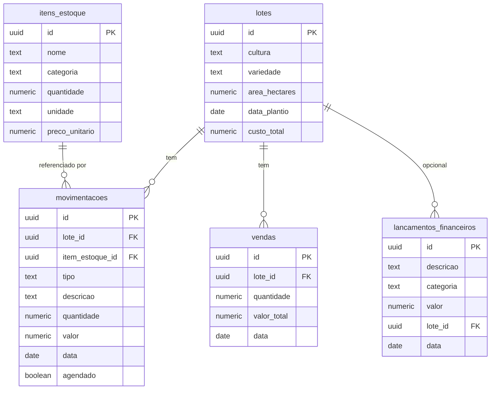

# Supabase — banco de dados e API

## Por que Supabase, e como ele se encaixa aqui

O AgroTech Portal **não tem um backend próprio**. O Supabase é um Postgres gerenciado que expõe automaticamente uma API REST (via [PostgREST](https://postgrest.org)) para cada tabela do banco. O frontend fala direto com essa API usando a lib `@supabase/supabase-js`:

```
React (navegador) → @supabase/supabase-js → API REST do Supabase → Postgres
```

Isso significa: não existe servidor Node/Express/FastAPI no meio. Todo o código que hoje mexe em dados vive em `src/services/*.ts`, chamando o client em `src/lib/supabaseClient.ts`.

**Autenticação não está implementada.** Qualquer pessoa com a URL do projeto e a chave pública consegue ler e escrever em todas as tabelas — ver [Segurança e RLS](#segurança-e-rls) mais abaixo antes de considerar isso pronto pra produção com dados sensíveis de terceiros.

---

## Criar o projeto no Supabase

1. Acesse [supabase.com](https://supabase.com) → **Start your project** → entre com GitHub (mais rápido) ou e-mail.
2. **New project**:
   - **Organization**: crie uma se for a primeira vez.
   - **Name**: `agrotech` (ou o nome que preferir).
   - **Database Password**: gere uma senha forte e **guarde em local seguro** — é o acesso direto ao Postgres, diferente da chave da API.
   - **Region**: a mais próxima do Brasil (`South America (São Paulo)`, se disponível).
   - Plano **Free** é suficiente.
3. Aguarde alguns minutos até o projeto provisionar.

## Aplicar o schema

O schema do banco vive versionado em `supabase/migrations/` — é a fonte de verdade, não algo que se configura manualmente pelo dashboard.

1. No dashboard do projeto, abra **SQL Editor** → **New query**.
2. Abra o arquivo [`supabase/migrations/20260728000000_init.sql`](../supabase/migrations/20260728000000_init.sql) deste repositório, copie o conteúdo inteiro e cole no editor.
3. Clique em **Run**.

Isso cria as 5 tabelas do projeto (ver [Schema](#schema) abaixo) já com as políticas de acesso configuradas.

> Se no futuro precisar alterar o schema, **não edite esse arquivo** — crie um novo em `supabase/migrations/` com um nome tipo `20260901000000_nome_da_mudanca.sql` e aplique do mesmo jeito pelo SQL Editor. Assim o histórico de mudanças fica registrado no Git.

## Pegar as credenciais

O dashboard do Supabase reorganizou isso recentemente — URL e chave não ficam mais na mesma tela.

**Project URL:**
- Mais rápido: botão **Connect** (perto do nome do projeto, no topo do dashboard) — abre um diálogo com a URL e a chave já prontas pra copiar.
- Alternativa: **Settings → Data API** (em algumas contas aparece como "Integrations → Data API").
- Sempre funciona: em **Settings → General** tem o "Project ID"/Reference ID — a URL é sempre `https://<project-id>.supabase.co`.

  ⚠️ **Atenção**: a tela de Data API mostra o endpoint REST completo, algo como `https://xxxxx.supabase.co/rest/v1/`. Para `VITE_SUPABASE_URL`, use só a base, **sem** o `/rest/v1/` no final — a biblioteca do Supabase completa esse caminho sozinha.

**Chave (API Key):**
- **Settings → API Keys** → use a **Publishable key** (formato `sb_publishable_...`). É a chave pública, segura para expor no frontend.
- Existe também uma aba "Legacy API Keys" com a antiga `anon key` (formato JWT) — ainda funciona, mas está sendo descontinuada pelo Supabase. Prefira sempre a Publishable key nova.

Cole os dois valores no `.env.local` (ver [SETUP.md](./SETUP.md)):

```
VITE_SUPABASE_URL=https://SEU-PROJETO.supabase.co
VITE_SUPABASE_ANON_KEY=sb_publishable_...
```

Em produção (Vercel), as mesmas variáveis vão em **Project Settings → Environment Variables** — ver o [README](../README.md#deploy-na-vercel).

---

## Schema



| Tabela | O que representa | Ligações |
| --- | --- | --- |
| `lotes` | Um lote/safra cadastrado em "Minha Roça" | — |
| `itens_estoque` | Um insumo cadastrado no "Galpão" | — |
| `movimentacoes` | Uma entrada no diário de um lote (insumo aplicado, mão de obra, diesel, nota) — substitui o campo de texto livre `diario` que existia no protótipo Python original | `lote_id` obrigatório · `item_estoque_id` opcional |
| `vendas` | Uma venda de safra | `lote_id` opcional (fica `null` se o lote não foi encontrado — ver [migração de dados](#migração-dos-dados-do-protótipo-python)) |
| `lancamentos_financeiros` | Um gasto avulso lançado na tela de Finanças (não vinculado a uma "operação" de lote) | `lote_id` opcional |

Ao apagar um `lote`, suas `movimentacoes` são apagadas junto (`on delete cascade`). Ao apagar um `item_estoque`, as `movimentacoes` que o referenciavam **não** são apagadas — só perdem o vínculo (`on delete set null`).

Os tipos TypeScript equivalentes estão em [`src/types/index.ts`](../src/types/index.ts) (em `camelCase`; a tradução `snake_case` ↔ `camelCase` acontece nas queries — ver [DEVELOPMENT.md](./DEVELOPMENT.md)).

## Segurança e RLS

Toda tabela tem *Row Level Security* (RLS) habilitado, mas com uma política totalmente permissiva:

```sql
create policy "Acesso público (sem auth) - lotes" on lotes
  for all using (true) with check (true);
```

Na prática isso equivale a **não ter proteção nenhuma**: qualquer pessoa que descubra a URL do projeto e a chave pública (que fica visível no código do site, é pra isso que ela existe) consegue ler e escrever em qualquer tabela. Isso foi uma decisão consciente — o projeto ainda não tem autenticação de usuários.

Para um uso pessoal/entre poucas pessoas de confiança, isso é aceitável. Se um dia isso virar algo mais público, o caminho é:
1. Configurar o Supabase Auth (login por e-mail, Google, etc.)
2. Trocar as policies de `using (true)` para algo como `using (auth.uid() = user_id)`, o que exige adicionar uma coluna `user_id` nas tabelas.

O schema já foi desenhado pra essa mudança ser só nas policies + uma coluna nova — não precisa reestruturar nada.

## Migração dos dados do protótipo Python

O script [`scripts/migrate-json.mjs`](../scripts/migrate-json.mjs) foi usado **uma única vez** para importar os dados do app antigo em Streamlit (`AgroTech/*.json`) pro Supabase. Ele:
- Lê `meu_plantio.json`, `meu_estoque.json`, `vendas.json`, `minhas_financas.json`
- Converte datas `dd/mm/yyyy` (e `dd/mm` sem ano) para o formato ISO usado no banco
- Transforma o campo de texto livre `diario` de cada lote em linhas estruturadas de `movimentacoes`
- Tenta casar o nome do "lote" em vendas/lançamentos com o `cultura` de um lote cadastrado (nem sempre bate — ver aviso abaixo)

**Não rode esse script de novo contra um banco que já tem dados** — ele não verifica duplicados, então rodar duas vezes duplica tudo. Ele só existe pra registro histórico de como os dados foram trazidos; não faz parte do fluxo normal de uso do app.

Se rodar (ex: recriando o ambiente do zero a partir dos JSONs originais):
```bash
node --env-file=.env.local scripts/migrate-json.mjs
```
Ao final ele imprime um resumo e uma lista de avisos — por exemplo, lançamentos financeiros que citavam um lote ("Milho") que não existia nos dados de plantio, e por isso foram importados sem vínculo.
